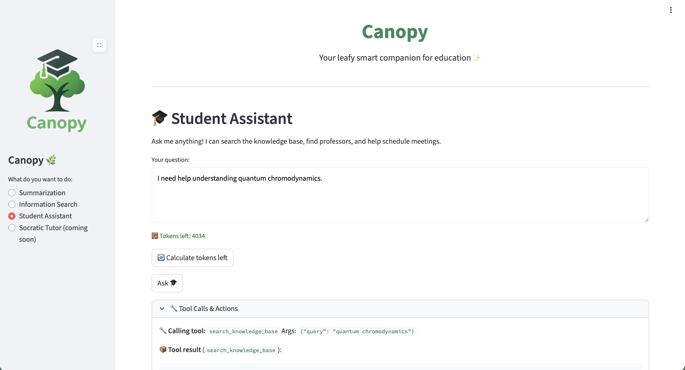

# Take Agents to Prod

Now that we have our new fresh agent, let's take it to production!  
There are a few things we want to do, such as evaluating and observing the agent, but let's start with adding in the feature flag to enable it in the backend.

## Deploy the Agent through GitOps

1. We need to start by upgrading our test and prod Llama Stack, go to `genaiops-gitops/canopy/test/ogx/config.yaml` and update to this:

    ```yaml
    ---
    chart_path: charts/llama-stack-operator-instance
    models:
      - name: "llama32"
        url: "http://llama-32-predictor.ai501.svc.cluster.local:8080/v1"
    rag:                
      enabled: true     
      milvus:                 
        service: "milvus-test" 
    guardrails:
      enabled: true
    mcp:                # 👈 Add this ❗︎❗︎
      enabled: true     # 👈 Add this ❗︎❗︎❗︎
    ```

2. Push this to git so that it takes effect:

    ```bash
    cd /opt/app-root/src/genaiops-gitops
    git pull
    git add .
    git commit -m "📃 enable MCP 📃"
    git push origin main
    ```

3. After Llama Stack has MCP enabled, we need to update our Canopy backend so it can use the agent feature. Go to your workbench and open the file `genaiops-gitops/canopy/test/backend/config.yaml`

4. Edit the file to contain the `student-assistant` feature flag. Feel free to change the prompt, this is the system prompt just like before.

    ```yaml
    ---
    repo_url: https://gitea-gitea.<CLUSTER_DOMAIN>/<USER_NAME>/backend
    chart_path: chart
    summarization:
      enabled: true
      model: vllm-llama32/llama32
      endpoint: "http://llama-stack-service:8321/v1"
      mlflow_prompt: summarization
      mlflow_prompt_version: latest
    information-search:
      enabled: true
      endpoint: "http://llama-stack-service:8321/v1"
      model: vllm-llama32/llama32
      vector_db_id: genaiops_2026_05_25_21_39
      mlflow_prompt: information-search
      mlflow_prompt_version: latest
    feedback:
      enabled: false
    ab_testing:             
      enabled: false         
      mlflow_prompt_b_version: latest 
    shields:
      enabled: true
      shield_id: nemo-guardrail 
    student-assistant:         # 👈 add this block ❗︎❗︎❗︎ ❗︎❗︎❗︎ ❗︎❗︎❗︎
      enabled: true
      model: vllm-llama32/llama32
      temperature: 0.1
      vector_db_id: latest
      mcp_calendar_url: "http://canopy-mcp-calendar-mcp-server:8080/sse"
      mlflow_prompt: student-assistant
      mlflow_prompt_version: latest
    ```

5. Before we push this change, we need to create `student-assistant` prompt in our prompt registry. Go to OpenShift Dashboard > Gen AI Studio > Prompts under `<USER_NAME>-toolings` project and create `student-assistant` prompt. Then add this below prompt with a nice commit message:

    ```bash
    You are a helpful assistant that helps students with their calendar and studies.
    Today is {datetime.today().strftime('%Y-%m-%d')}.

    Your workflow:

    1. If student asks about their schedule ("What lectures do I have?"):
      - Call get_upcoming_events
      - Show them the results
      - DONE (don't modify anything)

    2. If student asks a question about a topic ("I need help understanding X"):
      - First: call search_knowledge_base with the topic
      - If knowledge base has relevant information: answer their question with that information, DONE
      - If knowledge base has NO relevant information:
        a) Call find_professors_by_expertise to find an expert
        b) Call get_events_by_date to check for scheduling conflicts
        c) Call create_event to schedule a meeting with the professor at a free time
        d) Tell the student you scheduled the meeting

    When scheduling with create_event:
    - Pick a reasonable time that's free (check with get_events_by_date first)
    - Use these parameters: name, category, level, start_time, end_time, content
    - Do NOT include sid, status, or creation_time
    ```


6. Deploy calendar API for your test environment via GitOps as well so that you can freely continue iterating on your experiment environment while further evaluation tests can happen in the test environment before taking the current setup to production. 

  But this time, let's deploy it via GitOps! Create `calendar-mcp` folder under `/opt/app-root/src/genaiops-gitops/canopy/test` , then create `config.yaml` file, or simply run below command:

  ```bash
   mkdir /opt/app-root/src/genaiops-gitops/canopy/test/calendar-mcp
   touch /opt/app-root/src/genaiops-gitops/canopy/test/calendar-mcp/config.yaml
  ```

  And add the following config that points to the related helm chart:

  ```yaml
  repo_url: https://github.com/rhoai-genaiops/mcp.git
  chart_path: mcp-calendar-app/helm
  fullnameOverride: canopy-mcp-calendar
  ```

7. Push the changes to Git..because, you know, GitOps!

  ```bash
    cd /opt/app-root/src/genaiops-gitops/canopy/
    git pull
    git add .
    git commit -m "📆 Agent feature and Calendar MCP added 📆"
    git push
  ```

8. Open the Canopy UI, change to the Student Assistant on the left side and ask `I need help understanding quantum chromodynamics.`.  
    The agent should try to find the information, fail, and then find a professor to help you and schedule a call with them.  

    If you don't have the Canopy open any longer, you can find it here: [https://canopy-ui-<USER_NAME>-test.<CLUSTER_DOMAIN>](https://canopy-ui-<USER_NAME>-test.<CLUSTER_DOMAIN>)

    
