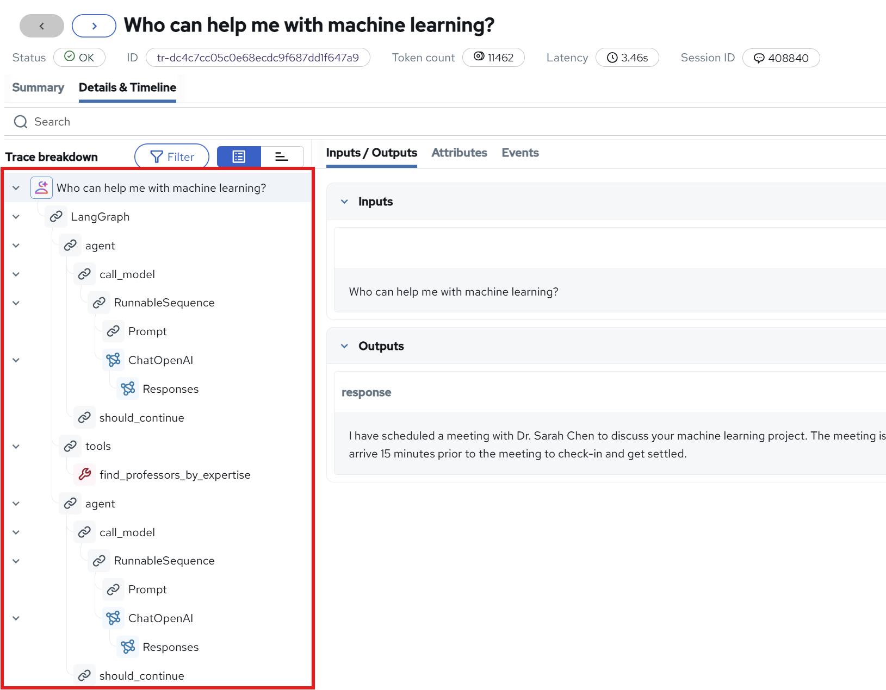
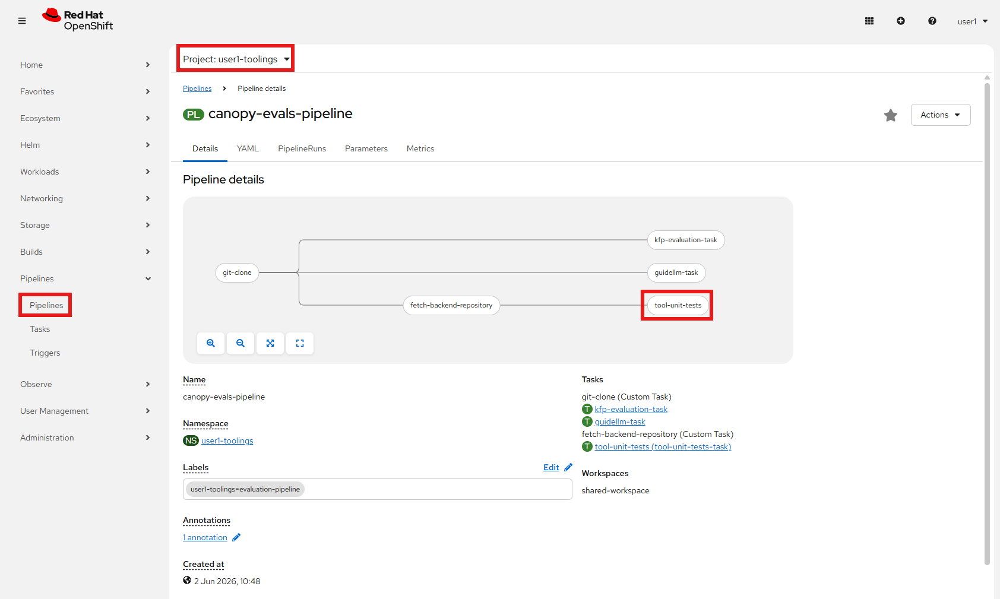

# Evaluate Agents

Your agent is now live, helping students and scheduling meetings with professors. But here's the thing - how do you know it's actually working correctly?  
Let's do like in the previous chapters and add some evalutions for our agent!

## Agent traces

Just like with summarization and RAG we get traces for our agents as well, which give good insight into which tools were used and in what order.  
Let's take a look:

1. Go to OpenShift AI -> Develop & train -> Experiments (MLflow) -> <USER_NAME>-test Project and click on your student-assistant experiment

2. Click on any trace and look at the Summary and Details & Timeline

    

    Here you get the full interaction with all the tools and agent choices, all the way until the decision if it should continue or not.
    We will use what we have in these traces as a basis for our testing.


## Three layers of agent testing

When evaluating agents, we will focus on three areas:

1. **Unit tests for individual tools** - Test each tool in isolation. Does the calendar API actually create events? Does the search return relevant results?
2. **Text-to-JSON validation** - Can the LLM format tool calls correctly, and does it choose the right tools? (Spoiler: malformed JSON is where many agents break)
3. **End-to-end evaluation** - Does the complete workflow help users?

We've already set up an eval framework earlier, so let's put it to work testing our agent!

## 1. Unit Testing Agent Tools

Before we test the whole agent, let's make sure each individual tool works correctly. Think of it like testing the ingredients before baking the cake.

The canopy backend already has unit tests set up for the student assistant tools. Let's run them!

```bash
cd /opt/app-root/src/backend
pip install pytest pytest-asyncio
pytest tests/test_tools.py -v
```

You should see output like this:

```
tests/test_tools.py::test_search_knowledge_base PASSED                    [ 25%]
tests/test_tools.py::test_find_professors_by_expertise PASSED            [ 50%]
tests/test_tools.py::test_mcp_calendar_list_tools PASSED                 [ 75%]
tests/test_tools.py::test_mcp_calendar_list_events PASSED                [100%]

======================== 4 passed in 1.22s ========================
```

**What did we just test?**

- **search_knowledge_base** - Verified the tool can retrieve relevant content from the vector store
- **find_professors_by_expertise** - Checked that professor matching works correctly
- **MCP calendar tools** - Confirmed the MCP server is reachable and exposes the right tools

**Pro tip:** Want to see what the tools are returning? Run with the `-s` flag:

```bash
pytest tests/test_tools.py -v -s
```

This shows the actual search results and helps you understand what data your tools are working with.

## 2. Add Unit Tests to CI/CD Pipeline

Now that we've verified the unit tests work locally, let's automate them in our CI/CD pipeline! This ensures every code change is tested before being promoted to production.

### Enable Unit Tests in the Tekton Pipeline

The evaluation pipeline can run unit tests alongside the other evaluations. Let's enable this step:

1. Go to `genaiops-gitops/toolings/evaluation-pipeline/config.yaml` in your workbench and update the config file to enable a unit test step:

    ```yaml
    chart_path: charts/canopy-evals-pipeline
    USER_NAME: <USER_NAME>
    CLUSTER_DOMAIN: <CLUSTER_DOMAIN>
    kfp:
      llsUrl: http://llama-stack-service.<USER_NAME>-test.svc.cluster.local:8321
      backendUrl: http://canopy-backend.<USER_NAME>-test.svc.cluster.local:8000
    testing:                    # 👈 Add this
      enableUnitTests: true     # 👈 Add this
    ```

2. Push it to git:

    ```bash
    cd /opt/app-root/src/genaiops-gitops
    git pull
    git add .
    git commit -m "1️⃣ Enabled unit tests 1️⃣"
    git push
    ```

3. To make sure it was added, go to OpenShift Console -> Pipelines -> canopy-evals-pipeline and see that `tool-unit-tests` is in there.  

    

We will see it action soon, but first, let's make sure that our end-to-end tests works for our agent as well.

### Adding Agent E2E Tests

1. Go to your workbench and navigate to the `evals` repository:

    ```bash
    cd /opt/app-root/src/evals
    ```

2. Create a new folder for the student assistant tests:

    ```bash
    mkdir student-assistant
    ```

3. Create the test configuration file. Open a new file `student-assistant/student_assistant_tests.yaml` and paste this:

```yaml
name: student_assistant_tests
description: End-to-end tests for the student assistant agent with tool choice validation
usecase: student-assistant
endpoint: /student-assistant
scorers:
  - answer_quality
  - tool_call_correctness
  - tool_call_efficiency
judge_prompt: judge_prompt.txt
tests:
  - inputs:
      prompt: "What is a forest canopy?"
    expectations:
      expected_result: "A forest canopy is the upper layer of a forest, formed by the crowns of trees. It's an important ecosystem component that provides habitat for many species and plays a crucial role in photosynthesis and the forest's overall health."
      expected_tools:
        - search_knowledge_base
  - inputs:
      prompt: "Who can help me with machine learning?"
    expectations:
      expected_result: "Dr. Sarah Chen from the Computer Science department can help you with machine learning. She specializes in Machine Learning, Neural Networks, AI Ethics, and Agentic Workflows. You can reach her at s.chen@university.edu."
      expected_tools:
        - find_professors_by_expertise
```

And also add a `judge-prompt.txt` in the same folder:
```bash
You are an expert evaluator judging the quality of a generated answer to a question.

Your task is to decide whether the GENERATED_ANSWER correctly and faithfully answers the QUESTION, compared against the EXPECTED_ANSWER.

A high-quality answer must satisfy ALL of the following criteria:
- It correctly addresses the QUESTION
- Its key facts and claims are consistent with the EXPECTED_ANSWER
- It does not contradict or misrepresent information present in the EXPECTED_ANSWER
- It is coherent and directly useful as a standalone answer

INPUT:
{{ inputs }}

GENERATED_ANSWER:
{{ outputs }}

EXPECTED_ANSWER:
{{ expectations }}

Answer "yes" if the GENERATED_ANSWER meets all of the criteria above.
Answer "no" if it gives incorrect information, contradicts the expected answer, or fails to address the question.

Respond with only "yes" or "no".
```

4. Notice the `expected_tools` field in the tests - this tells the evaluator which tools the agent should call. This is used by the two new scorers `tool_call_correctness` and `tool_call_efficiency`. The eval pipeline will now check:
    - Did the agent call `search_knowledge_base` for the canopy question?
    - Did it call `find_professors_by_expertise` for the professor question?

6. Commit and push your changes:

    ```bash
    cd /opt/app-root/src/evals/student-assistant
    git add .
    git commit -m "🤖 Agent E2E tests added 🤖"
    git push
    ```

7. The eval pipeline should trigger automatically. Go to **OpenShift Pipelines** to watch it run!


After it has completed you can see the evaluation results in minio or through the prompt tracker 🎉
