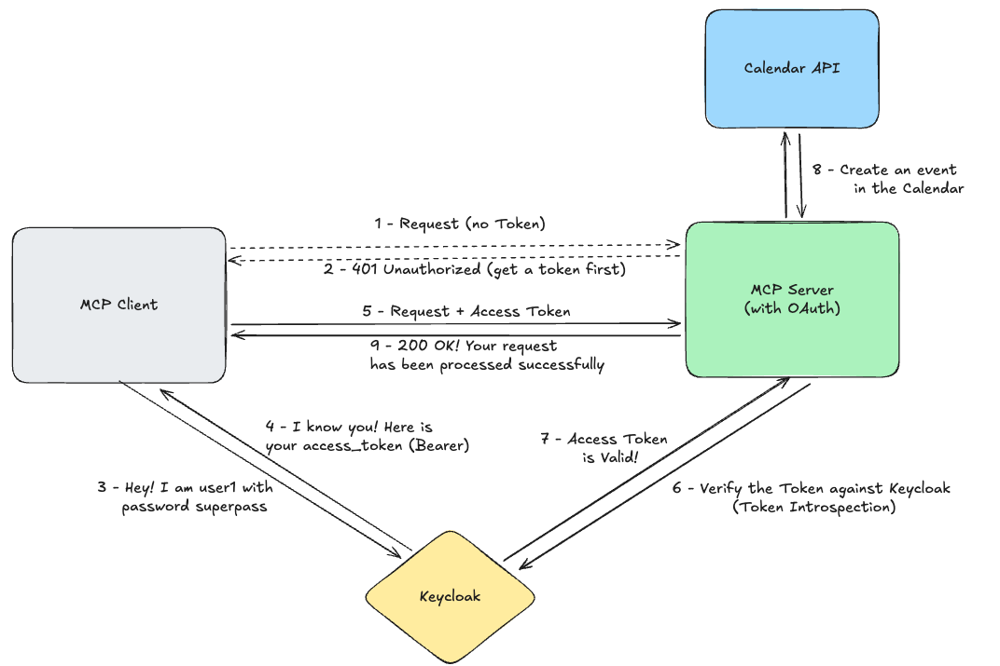

# Securing MCP Servers

Your agent now has powerful tools - it can read calendars, schedule meetings, and access sensitive data. But wait... who's allowed to use these tools? Right now, **anyone** can access your MCP server!

Think of it like a university library. The open stacks are free for everyone, but the rare book collection? You need to show your student ID. MCP servers work the same way - we use **OAuth 2.1** to verify who's knocking on the door.

## When Do You Need Authentication?

According to the [MCP Authorization Guide](https://modelcontextprotocol.io/docs/tutorials/security/authorization#when-should-you-use-authorization), you need security when:

- **Multiple users** access the server (each with different permissions)
- **Sensitive data** is involved (calendars, grades, personal info)
- **Write operations** can modify state (creating/deleting events)

Our calendar MCP server checks all three boxes! Students should only see their own events, and we don't want random requests creating fake meetings.

## The MCP Authorization Flow

Here's how token-based security works for MCP leveraging OAuth:

**What's happening:**

1. Client tries to access MCP Server without a token → **401 Unauthorized**
2. Client authenticates with Keycloak (username + password)
3. Keycloak returns an **access token** with granted scopes
4. Client retries with `Authorization: Bearer <token>`
5. MCP Server validates the token via **introspection**
6. If valid → request proceeds to Calendar API
7. Success!

The key insight: the MCP server never sees passwords. It only validates tokens issued by a trusted authority (Keycloak).

## Try It Out

Open the notebook `8-agents/5-mcp-servers-auth.ipynb` in your workbench to see OAuth in action.

## Key Takeaways

| Concept | Why It Matters |
|---------|----------------|
| **Authentication** | Only users with valid credentials get tokens |
| **Authorization** | Scopes control what operations are allowed |
| **Token Expiration** | Tokens expire after 10 minutes, limiting exposure |
| **Centralized Control** | Keycloak manages users, clients, and permissions |

With OAuth protecting your MCP server, you can safely deploy agents in production without worrying about unauthorized access!

---

## 🤔 Think About It

We've secured the MCP server... but is that the whole picture? Consider this: **what other attack surfaces exist in our agentic architecture?**